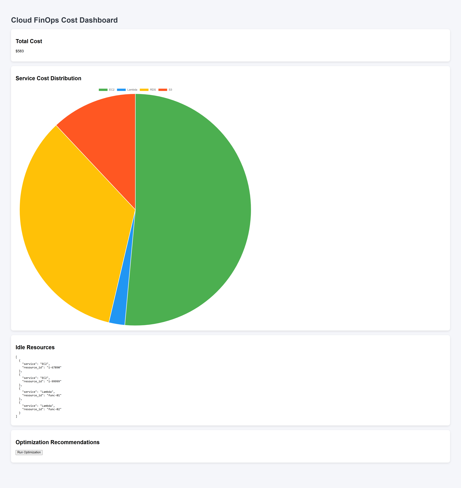

# Cloud FinOps Cost Optimization Platform

## Dashboard Preview




This project simulates a Cloud FinOps system that analyzes cloud resource usage and identifies cost optimization opportunities.

## Features

- FastAPI backend for cloud cost analytics
- Detect idle cloud resources
- Service-level cost breakdown
- Optimization recommendations
- Docker containerized deployment

## Tech Stack

- Python
- FastAPI
- Pandas
- Docker
- HTML / JavaScript (Dashboard UI)

## API Endpoints

- `/total-cost`
- `/service-costs`
- `/idle-resources`
- `/recommendations`
- `/dashboard`
- `/health`

## Run Locally

```bash
pip install -r requirements.txt
uvicorn app.main:app --reload

```


## Run Using Docker

Build Docker image

docker build -t expense-tracker-api .

Run container

docker run -p 5000:5000 expense-tracker-api

Open:
http://localhost:8000


## Architecture

User → Web Dashboard → FastAPI Backend → Cost Analysis Engine → Cloud Usage Dataset


